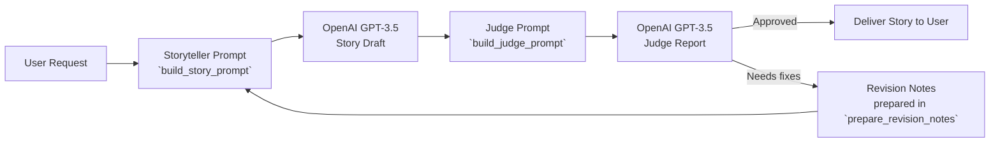

# Bedtime Storyteller Flow

```mermaid
flowchart LR
    A[User Request] --> B[Storyteller Prompt<br/>`build_story_prompt`]
    B --> C[OpenAI GPT-3.5<br/>Story Draft]
    C --> D[Judge Prompt<br/>`build_judge_prompt`]
    D --> E[OpenAI GPT-3.5<br/>Judge Report]
    E -->|Approved| F[Deliver Story to User]
    E -->|Needs fixes| G[Revision Notes<br/>prepared in `prepare_revision_notes`]
    G --> B
```
